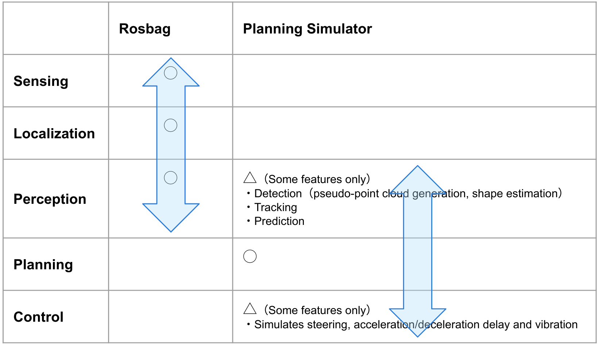

# AutowareArchitectureProposal Tutorials

The following tutorials were originally created for a workshop given at the 2020 Arm DevSummit event, and have been modified for inclusion in the AutowareArchitectureProposal repository. If you have any comments or feedback regarding how these tutorials can be improved, then please feel free to create an issue and @ the original author or the last person who edited the tutorial file.

- [Tutorial 1: RViz basics and replaying a rosbag](1_rosbag.md)
- [Tutorial 2: Localization using NDT Scan Matching](2_localization.md)
- [Tutorial 3: Simulation testing with dummy objects](3_simulation.md)

We assume that you've [installed and set up the AutowareArchitectureProposal already](https://github.com/tier4/AutowareArchitectureProposal.proj#autoware-setup).

## Simulation in Autoware

Autoware provides two types of simulation:
- rosbag-based simulation that can be used for testing/validation of the `Sensing`, `Localization` and `Perception` stacks (this was covered in the first two tutorials)
- The Planning Simulator tool which is mainly used for testing/validation of `Planning` stack by simulating traffic rules, interactions with dynamic objects and control commands to the ego vehicle (covered in the third tutorial)

## Note

- For the first two tutorials, two terminal windows will be used. However, the number of terminals required when using Autoware scales with the complexity of the overall system and can be as many as 10-12 in an actual autonomous vehicle!
- Although it is perfectly acceptable for workshop participants to use any terminal application that is included with the base install of Ubuntu 18.04 LTS, the [Terminator application](https://gnometerminator.blogspot.com/p/introduction.html) is used internally by Tier IV and is highly recommended.

    Here are some basic Terminator commands that will come in useful during the tutorials:

      - To split windows in Terminator
          - Press Ctrl + Shift + O to split a terminal horizontally
          - Press Ctrl + Shift + E to split a terminal vertically
      - To move between terminals
          - Press Alt + Left/Right/Up/Down arrow keys
      - When running commands in multiple terminal Windows, the broadcast function of Terminator can be used:
          - Press Alt + A to turn broadcast on (all keyboard input will appear in all windows)
          - Press Alt + O to turn broadcast off
      - To cancel a running command
          - Press Ctrl + C
      - To close the current terminal
          - Press Ctrl + Shift + W

| Next |
| ---- |
| [Tutorial 1: RViz basics and replaying a rosbag](1_rosbag.md) |
