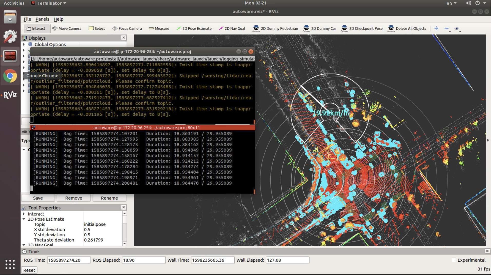

# Tutorial 1: RViz basics and replaying a rosbag

The purpose of this exercise is to gain familiarity with the basic functionality of RViz and how to replay a rosbag. [RVIz](http://wiki.ros.org/rviz) is a 3D visualization tool for the ROS middleware that Autoware is based on, and [rosbag](http://wiki.ros.org/rosbag) is the file format used to record and playback data from a ROS-based system.

Before starting, please download and unpack the following files:

* [Tutorial 1 map files](https://drive.google.com/open?id=1ovrJcFS5CZ2H51D8xVWNtEvj_oiXW-zk)
* [Tutorial 1 rosbag](https://drive.google.com/open?id=1BFcNjIBUVKwupPByATYczv2X4qZtdAeD)

> Note that these are the same files used in the [rosbag quick launch exercise](../../README.md#rosbag-simulation)

## Launch RViz, start and pause rosbag playback

1. Open two terminal windows and run the following commands in *both* terminals

```bash
cd ~/workspace/AutowareArchitectureProposal
source install/setup.bash
```

2. In the first terminal, launch RViz

```bash
roslaunch autoware_launch logging_simulator.launch vehicle_model:=lexus sensor_model:=aip_xx1 map_path:=/path/to/tutorial1_maps
```

3. In the second terminal, play the rosbag file

```bash
rosbag play --clock -r 0.2 /path/to/tutorial1_rosbag/sample.bag
```

4. In the still active second terminal, hit the spacebar after a few seconds to pause rosbag playback. You should now see something similar to the screenshot below.



---

## Adjust the RViz view (TopDownOrth and ThirdPersonFollower)

5. Click on the RViz icon to bring the GUI to the front, and then adjust RViz view (TopDownOrth):

- Clicking and holding the left mouse button then moving the mouse rotates the view in the same plane
- Clicking and holding the right mouse button then moving the mouse zooms in/out
- Holding the shift key and moving the mouse pans the view

6. Adjust RViz viewpoint to ThirdPersonFollower to change from a top-down 2D view to a 3D view

- In the Views panel on the left side of the window, click the Type dropdown box and select "ThirdPersonFollower"
- Double-click the Target Frame value and select "base_link"
- Click the “Zero” button


7. Adjust RViz view (ThirdPersonFollower):

- In ThirdPersonFollower view, clicking and holding the left mouse button then moving the mouse rotates the view in all directions
- Other functions (holding the right mouse button, holding shift) behave the same as for TopDownOrth

8. Click the [Zero] button in the Views panel to move the displayed view to the origin of the base_link (the center of the vehicle's rear axle)

---

## Resume rosbag playback and toggle display options

9. Click in the second terminal, then hit the spacebar to resume rosbag playback

10. Toggling display options

- In the `Displays` panel, click the triangle icons next to `Sensing` and then the one next `LiDAR`
- Toggle “ConcatenatePointCloud” off and on by clicking the checkbox.
- Toggle “NoGroundPointCloud” off and on by clicking the checkbox.

11. Once the rosbag playback has completed, click on the first terminal and press Ctrl + C to stop RViz, then close both terminals.

| Next |
| ---- |
| [Tutorial 2: Localization using NDT Scan Matching](2_localization.md) |
